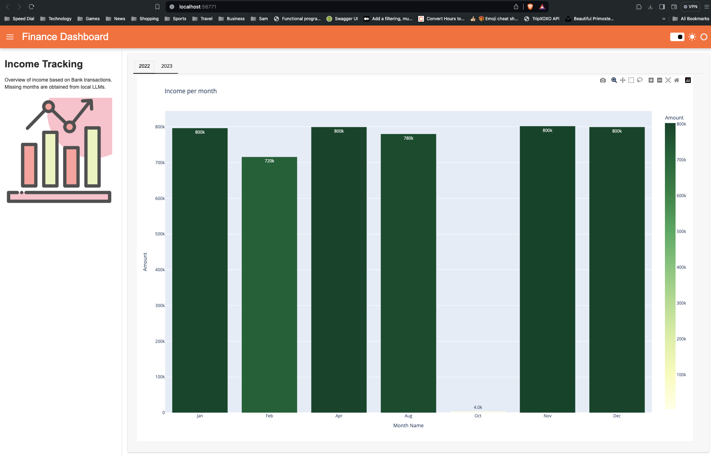
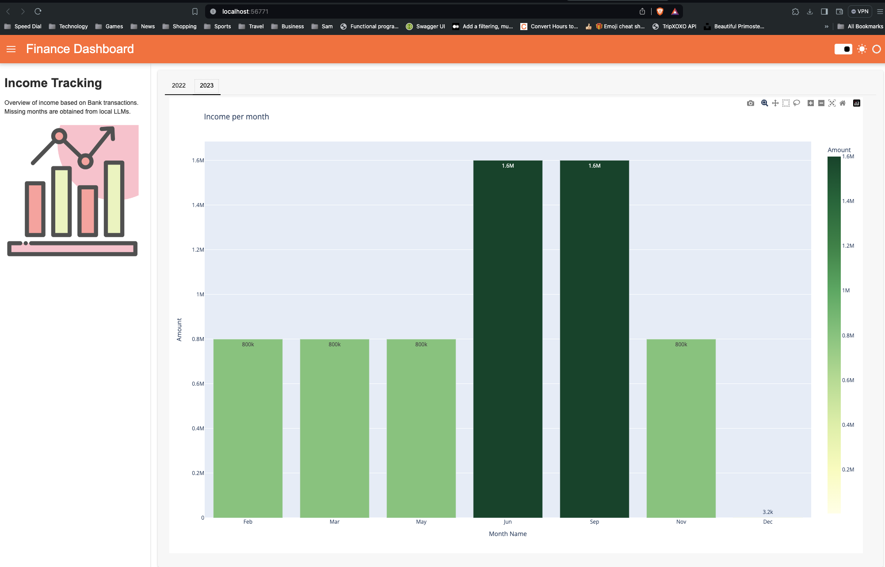

# Description
`local_llms_testing` is demo project to Run LLMS locally.
It uses [Ollama](https://ollama.com/) LLM to analyse financial transactions
Inspired from [LLMS Usage](https://github.com/thu-vu92/local-llms-analyse-finance). This project aims to solve slightly differnet problem apart from labeling the transaction.

## Caution
Although minimum requirements to run LLM seems fairly great, running LLM on local machine will take significant time to produce outputs.

# Simple Dashboard

## Disclaimer:
The example data in this repo are fictious and for illustration purposes.
